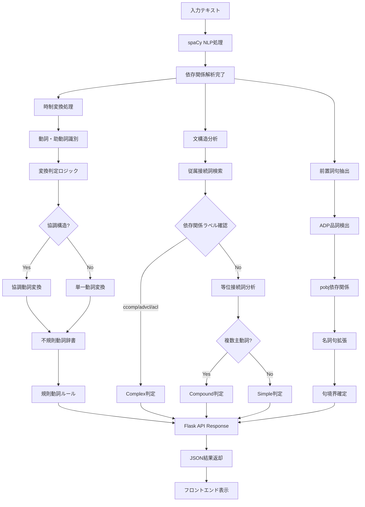
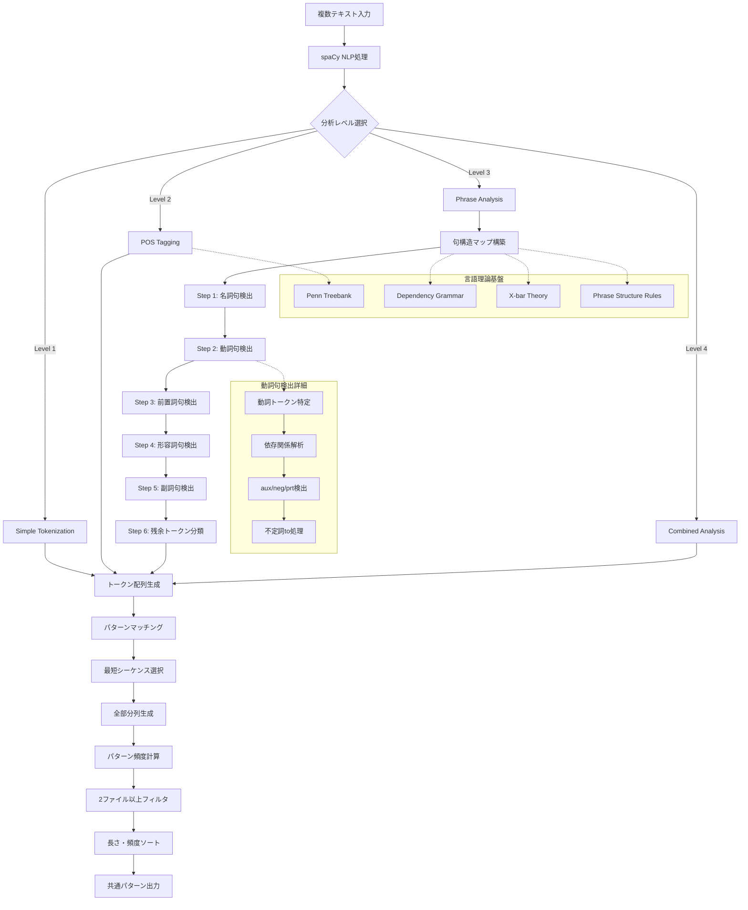

# Name of your Pattern-matching Tool
https://github.com/Hina524/patterns_and_language
# Group members

| 学籍番号     | 氏名           | 貢献内容                                          |
| -------- | ------------ | --------------------------------------------- |
| s1310141 | Hina Konishi | 70% (main programmer, test, report, analysis) |
| s1290116 | Tsubasa Sato | 30% (analysis)                                |
# 1. Tool description
## Webアプリケーション全体の目的

このWebアプリケーションは、**英語学習者、言語処理学習者の包括的な言語習得支援システム**として設計されています。
## 3つの主要機能

### 1. English Grammar Analyzer機能

英語の文章を入力すると、その文章を以下のように**文法的に分析**するツールです。
- **過去形変換**: 文章中の動詞を自動的に過去形に変換
- **文タイプ判定**: その文が Simple（単文）、Compound（重文）、Complex（複文）のどれかを判定
- **前置詞句抽出**: 文章の中にある前置詞句（"in the library"など）を自動で見つけ出す
#### 機能目的
- **包括的文法分析**: 入力された英語文の多面的文法構造解析
- **時制変換実践**: 現在形から過去形への変換を通じた動詞活用学習
- **文型理解促進**: Simple、Compound、Complex文の構造的違いの体験学習
- **前置詞句認識**: 英語特有の前置詞構造パターンの習得支援
### 2. Template Sentence Generator機能

英語の**文章作成を支援**するために、用途別のテンプレート文を提供してくれるツールです。以下の4つのカテゴリーのテンプレート文をランダムに生成します。
- **Topic Sentence**: 文章の導入部分で使える文
- **Sensory Details**: 五感を使った描写文
- **Spatial Details**: 場所や位置関係を表す文
- **Concluding Sentence**: 文章の結論部分で使える文
#### **機能目的**
- **ライティング支援**: 描写文の体系的構成方法の習得
- **語彙拡張促進**: カテゴリー別表現パターンの提供
- **創作インスピレーション**: ライティングブロック解消のアイデア生成
### 3. Pattern Finder機能

手動入力またはファイルアップロードで複数の英語テキストを比較して、それらの間にある**共通のパターンや表現**を以下の**4段階の分析レベル**で自動的に見つけ出すツールです。
  - Level 1: 単語レベルの共通パターン
  - Level 2: 単語 + 品詞タグの共通パターン  
  - Level 3: 単語 + 句タイプの共通パターン
  - Level 4: 単語 + 品詞 + 句タイプの包括的分析
#### **機能目的**
- **言語パターン認識**: 複数テキスト間の共通構造・表現の発見
- **比較言語学習**: 類似文構造の客観的分析による理解深化
- **語学研究支援**: corpus linguisticsの基礎的手法の実践
- **多層分析体験**: 語彙→品詞→句構造の段階的言語理解
# 2. Language analysis
## 1. English Grammar Analyzer機能
### Analysis
#### 1. 時制変換
```python
def convert_to_past_tense(self, text: str) -> str:
    doc = self.nlp(text)
    tokens = []
    for token in doc:
        if self._should_convert_to_past(token, doc):
            past_form = self._get_past_form(token)
            tokens.append(past_form)
        else:
            tokens.append(token.text)
```

**言語理論的基盤:**
- **spaCy依存関係解析**: 文構造の正確な把握による文脈適応型動詞変換
- **英語動詞活用体系**: 規則動詞（-ed付加）・不規則動詞（語幹変化）・助動詞の包括的処理
- **時制一致原理**: 文全体における時制の統一性維持
- **高精度形態論解析**: 語幹抽出→活用語尾処理→不規則動詞辞書照合
- **不規則動詞辞書**: 例) 80+ irregular verbs（shine→shone, swim→swam等）
- **協調動詞処理**: 例) "swim, run, and fly" → "swam, ran, and flew"
- **助動詞変換**: 例) "can" → "could", "will" → "would"

#### 2. 文構造分析
**理論的基盤: Dependency Grammar + Syntactic Parsing**

```python
def get_sentence_type(self, text: str) -> str:
    doc = self.nlp(text)
    subordinators = {'after', 'although', 'as', 'because', 'before'...}
    
    # 従属節検出
    for token in doc:
        if token.text.lower() in subordinators:
            if any(child.dep_ in ['ccomp', 'advcl', 'acl'] 
                   for child in token.head.children):
                return 'complex'
```

1. **Simple Sentence（単文）**: 単一主語+動詞構造
2. **Compound Sentence（重文）**: 等位接続詞による独立節結合
3. **Complex Sentence（複文）**: 従属接続詞による主節+従属節構造

**spaCy依存関係ラベル活用:**
- `ccomp`: 節補語 (clausal complement)
- `advcl`: 副詞節 (adverbial clause modifier)  
- `acl`: 関係節 (clausal modifier of noun)

#### 3. 前置詞句抽出
**依存関係解析による高精度抽出:**
```python
def get_prepositional_phrases(self, text: str) -> List[str]:
    doc = self.nlp(text)
    for token in doc:
        if token.pos_ == 'ADP':  # 前置詞検出
            for child in token.children:
                if child.dep_ == 'pobj':  # 前置詞の目的語
                    phrase_tokens.extend(self._get_noun_phrase_tokens(child, doc))
```

- **構文解析**: 前置詞 + 依存関係による目的語特定
- **句境界認識**: 修飾語・限定詞の包括的検出
- **ネスト構造**: "in the garden behind the house near the river"

### Algorithm Diagram


Fig. 1: [English Grammar Analyzer機能のAlgorithm Diagram]
## 2. Template Sentence Generator機能
### Analysis

#### 文章構造理論
**Academic Writing Theory + Paragraph Development Model**
```javascript
const topicSentences = [10個のテンプレート];      // 導入部
const sensoryDetails = [10個のテンプレート];      // 感覚描写
const spatialDetails = [10個のテンプレート];      // 空間描写
const concludingSentences = [9個のテンプレート];   // 結論部
```

**言語学的分析基盤:**

1. **Topic Sentence Analysis（主題文分析）**
   - **Discourse Markers**: "I want to describe", "Today, I will"
   - **Thematic Structure**: 主題提示→詳細展開の予告機能

2. **Sensory Description Framework（感覚描写枠組み）**
   ```javascript
   'It looks ___ and ___.',
   'You can hear ___, especially when ___.',
   'It smells like ___, and that reminds me of ___.'
   ```
   - **五感カテゴリー化**: 視覚・聴覚・嗅覚・触覚・味覚の体系的配置
   - **Cognitive Linguistics**: 感覚体験→言語表現のマッピング

3. **Spatial Coherence Theory（空間的結束理論）**
   ```javascript
   'It is located near ___.',
   'Around it, there are ___ and ___.',
   'Inside, you can find ___.'
   ```
   - **Spatial Deixis**: 位置関係を示す指示表現
   - **Topological Relations**: near, around, inside等の空間前置詞
#### **ランダム化アルゴリズム**
```javascript
function showRandomTemplate(list, label) {
    const idx = Math.floor(Math.random() * list.length);
    templateOutput.innerText = `${label}:\n${list[idx]}`;
}
```
- **Uniform Distribution**: 各テンプレートの等確率選択
- **Cognitive Load Theory**: 予測不可能性による創造的思考促進
### Algorithm Diagram

Fig. 2: [Template Sentence Generator機能のAlgorithm Diagram]
## 3. Pattern Finder機能
### Analysis
#### 多層言語分析システム
**spaCy + Dependency Grammar + Phrase Structure Grammar**

**Level 1: Lexical Analysis（語彙分析）**
```python
return [token.text for token in doc if not token.is_space]
```
- **Tokenization Theory**: 語境界認識による最小言語単位分割

**Level 2: Morpho-syntactic Analysis（形態統語分析）**
```python
return [(token.text, token.pos_) for token in doc if not token.is_space]
```
- **Penn Treebank Tagset**: DT, NN, VB, IN等の標準品詞体系
- **Part-of-Speech Tagging**: 統計的言語モデルによる品詞自動付与

**Level 3: Phrase Structure Analysis（句構造分析）**
```python
# 句読点除外による純粋句構造分析
if token.is_space or token.pos_ == 'PUNCT':
    continue
phrase_type = self.get_phrase_type(token, doc, phrase_map)
```

**理論的基盤: X-bar Theory + Dependency Grammar**
#### **句構造検出アルゴリズム**
```python
def _build_phrase_map(self, doc):
    # Step 1: spaCy noun_chunksによる名詞句検出
    for chunk in doc.noun_chunks:
        for i in range(chunk.start, chunk.end):
            phrase_map[i] = 'NP'
    
    # Step 2: 依存関係解析による動詞句検出
    if token.pos_ in ['VERB', 'AUX'] and token.i not in phrase_map:
        vp_tokens = self._get_verb_phrase_tokens(token, doc)
```

**動詞句境界検出:**
```python
def _get_verb_phrase_tokens(self, verb, doc):
    # 依存関係ラベルによる句構成要素特定
    for child in verb.children:
        if child.dep_ in ['aux', 'auxpass', 'neg', 'prt']:
            vp_tokens.add(child.i)
```
#### **パターンマッチング理論**
**Sequence Alignment + N-gram Analysis**

```python
def find_common_patterns(self, token_sequences):
    # 最短シーケンス基準による効率化
    base_idx = min(range(len(token_sequences)), 
                   key=lambda i: len(token_sequences[i][1]))
    
    # 全可能部分列探索
    for length in range(n, 0, -1):  # 長いパターン優先
        for start in range(n - length + 1):
            pattern = tuple(base_seq[start:start + length])
```

**計算量最適化:**
- **Time Complexity**: O(n²m) where n=sequence length, m=number of texts
- **Space Complexity**: O(nm) for pattern storage
### **🔬 Level 4統合分析の複雑性**

**Level 4: Multi-dimensional Analysis（多次元統合分析）**
```python
tokens.append((token.text, token.pos_, phrase_type))
```

**言語学的意義:**
- **Morpho-syntactic Interface**: 形態論と統語論の接続点分析
- **Feature Unification**: 品詞情報と句構造情報の統合
- **Linguistic Annotation**: 多層言語情報の同時表現

**句読点の理論的処理:**
```python
if token.pos_ == 'PUNCT':
    # Level 3: 句構造分析では除外
    continue
    # Level 4: POSは保持、句タイプは無効化
    tokens.append((token.text, token.pos_, 'O'))
```

**理論的根拠**: 句読点は**韻律境界（Prosodic Boundary**を示すが、**句構造（Phrase Structure**の構成要素ではない
### Algorithm Diagram


Fig. 3: [Pattern Finder機能のAlgorithm Diagram]
# 3. Software development
## 使用技術スタック
### プログラミング言語・フレームワーク
- **Python 3.11**
- **JavaScript ES6+**
- **HTML5**
- **CSS3**
### 主要ライブラリ
- **Flask 3.0.0**: 軽量Webフレームワーク
- **spaCy 3.8.5**: 産業標準NLPライブラリ（English Grammar Analyzer & Pattern Finder backend）
- **W3.CSS**: レスポンシブCSSフレームワーク

## 1. アプリケーション全体
### レスポンシブデザイン
全ての利用場面に対応するため、PC、スマートフォンのどちらからアクセスしても利用ができるようにしています。
![[スクリーンショット 2025-08-02 22.06.12.png]]
Fig. 4: [PCで起動した際の画面]

![[スクリーンショット 2025-08-02 22.07.05.png|400]]
Fig. 5: [スマートフォンで起動した際の画面]
### タブインターフェース
本アプリケーションは3つの機能があるため、MUIを参考にタブで機能切り替えができるようにしました。
![[スクリーンショット 2025-08-02 19.12.52.png]]
Fig. 6: [タブの画面]

```css
.tab-button {
    transition: all 0.3s ease;
    border-bottom: 2px solid transparent;
}
.tab-button.active {
    color: orange;
    border-bottom-color: orange;
}
```
## 2. English Grammar Analyzer機能
### 機能利用例
![[スクリーンショット 2025-08-02 22.06.12.png]]
Fig. 7: [English Grammar Analyzer機能の入力画面]
上記の初期画面のInput部分に英文を入力し、「Process」ボタンを押すと、
![[スクリーンショット 2025-08-02 22.24.46.png]]
Fig. 8: [English Grammar Analyzer機能の結果表示画面]
上記画像のように結果が表示されます。

### 工夫点
#### テキスト入力エリアの行数が入力文の長さに合わせて変動する
当初の実装では、長文を入力すると文字が見切れてしまったため、改善しました。Fig. 8の画像と比較し、Fig. 9ではテキスト入力エリアの行数が増えていることがわかります。

```javascript
function autoResize(textarea) {
    textarea.style.height = 'auto';
    const minHeight = 3 * 24; // 3 lines
    const maxHeight = 10 * 24; // 10 lines
    const scrollHeight = textarea.scrollHeight;
    // 動的高さ調整ロジック
}
```

![[スクリーンショット 2025-08-02 22.25.33.png]]
Fig. 9: [English Grammar Analyzer機能の入力エリアに長文を入力した画像]
## 3. Template Sentence Generator機能
### 機能利用例
オレンジ色のボタンのいずれかを選択して押すことで、選択したカテゴリのテンプレートが出力されます。
![[スクリーンショット 2025-08-02 22.29.03.png]]
Fig. 10: [Template Sentence Generator機能の結果表示画面]
### 工夫点
#### レスポンシブデザイン
スマホサイズ（600px以下）での Template Sentence Generator ボタンについて、PCサイズでのレイアウト(2×2)にすると文字が潰れてしまうので、縦一列の中央揃えにしました。
``` css
/* Template Sentence Generatorのボタン中央寄せ */
#templateTab .w3-row-padding {
	text-align: center;
	display: flex;
	flex-direction: column;
	align-items: center;
	gap: 8px;
}

#templateTab .w3-col {
	display: block;
	float: none;
	width: auto;
	max-width: 280px;
}

#templateTab .w3-button-orange {
	margin: 0 auto;
	display: block;
	width: auto;
	min-width: 200px;
	max-width: 280px;
}
```

![[スクリーンショット 2025-08-02 22.48.07.png|400]]
Fig. 11: [Template Sentence Generator機能のスマホサイズの画面]
## 4. Pattern Finder機能
### 機能利用例
最初に「Manual Text Input」（手入力）か「Upload Text Files」を選択します。
![[スクリーンショット 2025-08-02 22.53.40.png]]
Fig. 12: [Pattern Finder機能の初期画面]
#### 「Manual Text Input」を選択した場合
テキストを入力したあと、Levelを選択し、Processを押します。そうすると、結果が以下のように出力されます。３種類以上のテキストを分析する際は、「Add Text」ボタンを押すとテキスト入力エリアが増え、さらにテキストを入力することができます。
![[スクリーンショット 2025-08-02 22.55.56.png]]
Fig. 13: [Pattern Finder機能でManual Text Inputを選択した場合の結果画面]
#### 「Upload Text Files」を選択した場合
この場合、まずFig. 14のような画面に移動します。
- 枠内にテキストファイルをドラッグ&ドロップをする
- Select Text Filesボタンを押す
のいずれかの方法でテキストを入力することができます。ファイルは.txtファイルしかアップロードできないようになっています。
![[スクリーンショット 2025-08-02 23.09.26.png]]
Fig. 14: [Pattern Finder機能でUpload Text Filesを選択した場合の初期画面]

ファイルをアップロードすると、Fig. 15のように、Upload Filesの中で、入力したテキストの内容を確認することができます。レベルを選択し、Processボタンを押してからの画面は「Manual Text Input」を選択した場合と同様になります。
![[スクリーンショット 2025-08-02 23.27.28.png]]
Fig. 15: [Pattern Finder機能でテキストファイルをアップロードした際の画面]
### 工夫点
#### 1. デュアル入力システム
- **Textbox Input**: 動的テキストエリア追加/削除機能
- **File Upload**: ドラッグ&ドロップ + ファイル選択の二重サポート
##### 目的
**テキストボックス入力方式**
- 一般的な英語学習者はテキストをテキストファイルで所持しているケースは少なく、パターン分析をしたい英文を見つけたらすぐコピー＆ペーストで分析を実行できるようにしたい
- スマートフォン対応もしているため、この場合もこちらの方式が適切であると判断
	-> 一般的な英語学習者にはファイルアップロードよりこちらの方式が適切であると判断しました

**ファイルアップロード方式**
- NLP学習者はテキストをテキストファイルで保持していることが一般的であるため、こちらの方式が適切であると判断しました
- 分析を何回も繰り返すことを考えても、こちらが適切であると判断しました

以上より、テキストを与えるだけでも、二つの需要があることから、二つの方式を取ることは必須であると考えました
#### 2. ファイルアップロード時の分析対象テキスト表示
テキストボックスで入力する際は、テキストボックスを確認すれば分析対象のテキストを確認することができますが、アップロードの場合は確認することができませんでした。分析対象のテキストと出力結果を比較することが重要であるため、この機能を追加しました。
また、ユーザーフレンドリーな実装にするため、Fig. 16のように、分析対象のテキストの長さに合わせて表示枠が変動するようになっています。
![[スクリーンショット 2025-08-02 23.33.05.png]]
Fig. 16: [Pattern Finder機能で分析対象のテキストを確認する画面1]

また、文章が長すぎたり、スマホで見る場合は、Fig. 17のように一定の行数を超えるとスクロールができ流ようになり、必要以上に表示行数を増やさない工夫をしています。
![[スクリーンショット 2025-08-02 23.53.19.png|400]]
Fig. 17: [Pattern Finder機能で分析対象のテキストを確認する画面2]
