# Name of your Pattern-matching Tool

[https://github.com/Hina524/patterns_and_language](https://github.com/Hina524/patterns_and_language)

# Group members

| Student ID | Name         | Contribution                                   |
| ---------- | ------------ | ---------------------------------------------- |
| s1310141   | Hina Konishi | 100% (main programmer, test, report, analysis) |
| s1290116   | Tsubasa Sato | 0% ()                                          |

# 1. Tool description

## Overall Purpose of the Web Application

This web application is designed as a **comprehensive language acquisition support system for learners of English and natural language processing**.

## 3 Key Features

### 1. English Grammar Analyzer

This tool **grammatically analyzes** an English sentence entered by the user in the following ways:

- **Past Tense Conversion**: Automatically converts verbs in the sentence to the past tense.
    
- **Sentence Type Identification**: Determines whether the sentence is Simple, Compound, or Complex.
    
- **Prepositional Phrase Extraction**: Automatically finds prepositional phrases (e.g., "in the library") within the sentence.
    

#### Feature Purpose

- **Comprehensive Grammatical Analysis**: To provide a multi-faceted grammatical analysis of the input English sentence.
    
- **Practical Tense Conversion**: To facilitate learning of verb conjugation through conversion from present to past tense.
    
- **Promotion of Sentence Structure Understanding**: To provide an experiential learning of the structural differences between Simple, Compound, and Complex sentences.
    
- **Prepositional Phrase Recognition**: To support the acquisition of English-specific prepositional structure patterns.
    

### 2. Template Sentence Generator

This tool provides template sentences for various purposes to **assist in English composition**. It randomly generates template sentences from the following four categories:

- **Topic Sentence**: Sentences that can be used in the introductory part of a text.
    
- **Sensory Details**: Descriptive sentences using the five senses.
    
- **Spatial Details**: Sentences describing places and spatial relationships.
    
- **Concluding Sentence**: Sentences that can be used in the concluding part of a text.
    

#### **Feature Purpose**

- **Writing Support**: To aid in the acquisition of systematic composition methods for descriptive writing.
    
- **Vocabulary Expansion**: To provide expression patterns for different categories.
    
- **Creative Inspiration**: To generate ideas to overcome writer's block.
    

### 3. Pattern Finder

This tool compares multiple English texts, input either manually or via file upload, to automatically find **common patterns and expressions** among them at the following **four levels of analysis**:

- Level 1: Common patterns at the word level.
    
- Level 2: Common patterns of words + part-of-speech tags.
    
- Level 3: Common patterns of words + phrase types.
    
- Level 4: Comprehensive analysis of words + parts of speech + phrase types.
    

#### **Feature Purpose**

- **Language Pattern Recognition**: To discover common structures and expressions among multiple texts.
    
- **Comparative Language Learning**: To deepen understanding through objective analysis of similar sentence structures.
    
- **Linguistic Research Support**: To practice basic methods of corpus linguistics.
    
- **Multi-level Analysis Experience**: To provide a step-by-step linguistic understanding from vocabulary → part of speech → phrase structure.
    

# 2. Language analysis

## 1. English Grammar Analyzer

### Analysis

#### 1. Tense Conversion

Python

``` python
def convert_to_past_tense(self, text: str) -> str:
    doc = self.nlp(text)
    tokens = []
    for token in doc:
        if self._should_convert_to_past(token, doc):
            past_form = self._get_past_form(token)
            tokens.append(past_form)
        else:
            tokens.append(token.text)
```

**Linguistic Theoretical Basis:**

- **spaCy Dependency Parsing**: Context-aware verb conversion through accurate understanding of sentence structure.
    
- **English Verb Conjugation System**: Comprehensive handling of regular verbs (adding -ed), irregular verbs (stem change), and auxiliary verbs.
    
- **Principle of Tense Agreement**: Maintaining tense consistency throughout the entire sentence.
    
- **High-Precision Morphological Analysis**: Stem extraction → inflectional ending processing → irregular verb dictionary matching.
    

**Implementation Features:**

1. **Irregular Verb Dictionary (80+ verbs)**:
    
    - Basic verbs: go→went, come→came, see→saw, make→made
        
    - Be-verbs: is→was, are→were, am→was
        
    - Special verbs: shine→shone, swim→swam, fly→flew
        
    - Modal auxiliaries: can→could, will→would, may→might
        
2. **Coordinated Verb Processing**:
    
    - Bulk conversion of verbs linked by coordinating conjunctions.
        
    - Example: "They swim, run, and fly" → "They swam, ran, and flew"
        
    - 対応 to spaCy's tagging errors (VBN misidentification).
        
3. **Auxiliary Verb Structure Processing**:
    
    - Conversion of Modal auxiliary (MD): can→could, will→would
        
    - Verbs following modal auxiliaries remain in their base form: "can go" → "could go"
        
    - Appropriate conversion of be/have verbs: has→had, are→were
        
4. **Preservation of Progressive Form**:
    
    - Only the be-verb is converted, the -ing form is maintained.
        
    - Example: "We are walking" → "We were walking"
        
    - Accurate identification of progressive structures through dependency parsing.
        
5. **Precise Conjugation Rules for Regular Verbs**:
    
    - Ending in -e: like→liked
        
    - Consonant + y: study→studied
        
    - Vowel + y: play→played (prevents "playyed" error)
        
    - CVC pattern: stop→stopped
        
    - Others: work→worked
        

#### 2. Sentence Structure Analysis

**Theoretical Basis: Dependency Grammar + Syntactic Parsing**

Python

``` python
def get_sentence_type(self, text: str) -> str:
    doc = self.nlp(text)
    subordinators = {'after', 'although', 'as', 'because', 'before'...}
    
    # Subordinate clause detection
    for token in doc:
        if token.text.lower() in subordinators:
            if any(child.dep_ in ['ccomp', 'advcl', 'acl'] 
                   for child in token.head.children):
                return 'complex'
```

1. **Simple Sentence**: Single subject + verb structure.
    
2. **Compound Sentence**: Independent clauses joined by a coordinating conjunction.
    
3. **Complex Sentence**: Main clause + subordinate clause structure joined by a subordinating conjunction.
    

**Utilization of spaCy Dependency Labels:**

- `ccomp`: clausal complement
    
- `advcl`: adverbial clause modifier
    
- `acl`: clausal modifier of noun
    

#### 3. Prepositional Phrase Extraction

**High-precision extraction by dependency parsing:**

Python

``` python
def get_prepositional_phrases(self, text: str) -> List[str]:
    doc = self.nlp(text)
    for token in doc:
        if token.pos_ == 'ADP':  # Preposition detection
            for child in token.children:
                if child.dep_ == 'pobj':  # Object of a preposition
                    phrase_tokens.extend(self._get_noun_phrase_tokens(child, doc))
```

- **Syntactic Parsing**: Preposition + object identification through dependency relations.
    
- **Phrase Boundary Recognition**: Comprehensive detection of modifiers and determiners.
    
- **Nested Structures**: "in the garden behind the house near the river"
    

### Algorithm Diagram

コード スニペット



``` mermaid
flowchart TD
    A[Input Text] --> B[spaCy NLP Processing]
    B --> C[Dependency Parsing Complete]
    C --> D[Tense Conversion Processing]
    C --> E[Sentence Structure Analysis]
    C --> F[Prepositional Phrase Extraction]
    
    D --> D1[Verb/Auxiliary Identification]
    D1 --> D2[Conversion Decision Logic]
    D2 --> D3{Auxiliary Verb Check}
    D3 -->|Modal MD| D3A[can→could, etc. conversion]
    D3 -->|be/have| D3B[is→was, etc. conversion]
    D3 -->|No| D4{Progressive Form Check}
    D4 -->|Yes| D4A[Convert only be-verb<br/>Preserve -ing form]
    D4 -->|No| D5{Coordinated Structure?}
    D5 -->|Yes| D6[Coordinated Verb Conversion]
    D5 -->|No| D7[Single Verb Conversion]
    
    D3A --> G[Flask API Response]
    D3B --> G
    D4A --> G
    
    D6 --> D8{Irregular Verb?}
    D7 --> D8
    D8 -->|Yes| D9[Search 80+ verb dictionary<br/>swim→swam, etc.]
    D8 -->|No| D10[Regular Verb Rules]
    D10 --> D10A{Ending Check}
    D10A -->|e| D10B[+d: like→liked]
    D10A -->|consonant+y| D10C[y→ied: study→studied]
    D10A -->|vowel+y| D10D[+ed: play→played]
    D10A -->|CVC| D10E[double+ed: stop→stopped]
    D10A -->|other| D10F[+ed: work→worked]
    
    D9 --> G
    D10B --> G
    D10C --> G
    D10D --> G
    D10E --> G
    D10F --> G
    
    E --> E1[Search for Subordinating Conjunctions]
    E1 --> E2{Check Dependency Labels}
    E2 -->|ccomp/advcl/acl| E3[Determine as Complex]
    E2 -->|No| E4[Analyze Coordinating Conjunctions]
    E4 --> E5{Multiple Subject-Verb pairs?}
    E5 -->|Yes| E6[Determine as Compound]
    E5 -->|No| E7[Determine as Simple]
    
    F --> F1[Detect ADP POS]
    F1 --> F2[pobj Dependency]
    F2 --> F3[Expand Noun Phrase]
    F3 --> F4[Finalize Phrase Boundary]
    
    E3 --> G
    E6 --> G
    E7 --> G
    F4 --> G
    G --> H[Return JSON Result]
    H --> I[Display on Frontend]
```

Fig. 1: [Algorithm Diagram for English Grammar Analyzer]

## 2. Template Sentence Generator

### Analysis

#### Sentence Structure Theory

**Academic Writing Theory + Paragraph Development Model**

JavaScript

``` js
const topicSentences = [10 templates];      // Introduction
const sensoryDetails = [10 templates];      // Sensory Description
const spatialDetails = [10 templates];      // Spatial Description
const concludingSentences = [9 templates];   // Conclusion
```

**Linguistic Analysis Basis:**

1. **Topic Sentence Analysis**
    
    - **Discourse Markers**: "I want to describe", "Today, I will"
        
    - **Thematic Structure**: Presenting the main theme → Previewing the detailed development.
        
2. **Sensory Description Framework**
    
    JavaScript
    
    ``` js
    'It looks ___ and ___.',
    'You can hear ___, especially when ___.',
    'It smells like ___, and that reminds me of ___.'
    ```
    
    - **Five Senses Categorization**: Systematic arrangement of sight, hearing, smell, touch, and taste.
        
    - **Cognitive Linguistics**: Mapping sensory experiences to linguistic expressions.
        
3. **Spatial Coherence Theory**
    
    JavaScript
    
    ``` js
    'It is located near ___.',
    'Around it, there are ___ and ___.',
    'Inside, you can find ___.'
    ```
    
    - **Spatial Deixis**: Deictic expressions indicating spatial relationships.
        
    - **Topological Relations**: Spatial prepositions like near, around, inside.
        

#### **Randomization Algorithm**

JavaScript

``` ls
function showRandomTemplate(list, label) {
    const idx = Math.floor(Math.random() * list.length);
    templateOutput.innerText = `${label}:\n${list[idx]}`;
}
```

- **Uniform Distribution**: Equal probability selection for each template.
    
- **Cognitive Load Theory**: Promoting creative thinking through unpredictability.
    

### Algorithm Diagram

コード スニペット


Fig. 2: [Algorithm Diagram for Template Sentence Generator]

## 3. Pattern Finder

### Analysis

#### Multi-level Language Analysis System

**spaCy + Dependency Grammar + Phrase Structure Grammar**

**Level 1: Lexical Analysis**

Python

``` python
return [token.text for token in doc if not token.is_space]
```

- **Tokenization Theory**: Division into minimal linguistic units by recognizing word boundaries.
    

**Level 2: Morpho-syntactic Analysis**

Python

``` python
return [(token.text, token.pos_) for token in doc if not token.is_space]
```

- **Penn Treebank Tagset**: Standard part-of-speech system like DT, NN, VB, IN.
    
- **Part-of-Speech Tagging**: Automatic POS assignment using statistical language models.
    

**Level 3: Phrase Structure Analysis**

Python

``` python
# Pure phrase structure analysis by excluding punctuation
if token.is_space or token.pos_ == 'PUNCT':
    continue
phrase_type = self.get_phrase_type(token, doc, phrase_map)
```

**Theoretical Basis: X-bar Theory + Dependency Grammar**

#### **Phrase Structure Detection Algorithm**

Python

``` python
def _build_phrase_map(self, doc):
    # Step 0: Improve accuracy with custom corrections
    self._apply_custom_corrections(doc, phrase_map)
    
    # Step 1: Noun phrase detection using spaCy's noun_chunks
    for chunk in doc.noun_chunks:
        for i in range(chunk.start, chunk.end):
            phrase_map[i] = 'NP'
    
    # Step 2: Infinitive phrase detection (processed before verb phrases)
    for token in doc:
        if self._is_infinitive_marker(token, doc):
            inf_tokens = self._get_infinitive_phrase_tokens(token, doc)
            for tok_idx in inf_tokens:
                phrase_map[tok_idx] = 'INF-P'
    
    # Step 3: Verb phrase detection using dependency parsing
    if token.pos_ in ['VERB', 'AUX'] and token.i not in phrase_map:
        vp_tokens = self._get_verb_phrase_tokens(token, doc)
```

**Custom Correction Feature:**

Python

``` python
def _apply_custom_corrections(self, doc, phrase_map):
    """Addressing spaCy's tagging accuracy issues"""
    for token in doc:
        # Correction for gerund subjects (Swimming[PROPN] → Swimming[VP])
        if (token.pos_ == 'PROPN' and 
            token.tag_ == 'NNP' and 
            token.dep_ == 'nsubj' and 
            token.text.lower().endswith('ing')):
            phrase_map[token.i] = 'VP'
        
        # Unification of time expressions (today, now, etc. to ADVP)
        if self._is_time_expression(token, doc):
            phrase_map[token.i] = 'ADVP'
```

**Infinitive Phrase Detection:**

Python

``` python
def _is_infinitive_marker(self, token, doc):
    """Identification of 'to' + verb structure"""
    if (token.pos_ == 'PART' and 
        token.tag_ == 'TO' and 
        token.text.lower() == 'to'):
        # Check for a following verb
        if token.i + 1 < len(doc):
            next_token = doc[token.i + 1]
            if next_token.pos_ == 'VERB' and next_token.tag_ == 'VB':
                return True
```

**Verb Phrase Boundary Detection:**

Python

``` python
def _get_verb_phrase_tokens(self, verb, doc):
    # Identify phrase components using dependency labels
    for child in verb.children:
        if child.dep_ in ['aux', 'auxpass', 'neg', 'prt']:
            vp_tokens.add(child.i)
```

#### **Pattern Matching Theory**

**Sequence Alignment + N-gram Analysis**

Python

``` python
def find_common_patterns(self, token_sequences):
    # Efficiency improvement by using the shortest sequence as a baseline
    base_idx = min(range(len(token_sequences)), 
                   key=lambda i: len(token_sequences[i][1]))
    
    # Search all possible subsequences
    for length in range(n, 0, -1):  # Prioritize longer patterns
        for start in range(n - length + 1):
            pattern = tuple(base_seq[start:start + length])
```

**Computational Complexity Optimization:**

- **Time Complexity**: O(n²m) where n=sequence length, m=number of texts
    
- **Space Complexity**: O(nm) for pattern storage
    

### **🔬 Complexity of Level 4 Integrated Analysis**

**Level 4: Multi-dimensional Analysis**

Python

``` python
tokens.append((token.text, token.pos_, phrase_type))
```

**Linguistic Significance:**

- **Morpho-syntactic Interface**: Analysis of the connection point between morphology and syntax.
    
- **Feature Unification**: Integration of part-of-speech information and phrase structure information.
    
- **Linguistic Annotation**: Simultaneous representation of multi-level linguistic information.
    

**Theoretical Treatment of Punctuation:**

Python

``` python
if token.pos_ == 'PUNCT':
    # Level 3: Excluded from phrase structure analysis
    continue
    # Level 4: POS is retained, phrase type is nullified
    tokens.append((token.text, token.pos_, 'O'))
```

**Theoretical Rationale**: Punctuation indicates a **Prosodic Boundary** but is not a constituent of **Phrase Structure**.

### Algorithm Diagram

コード スニペット


Fig. 3: [Algorithm Diagram for Pattern Finder]

# 3. Software development

## Technology Stack

### Programming Languages & Frameworks

- **Python 3.11**: Backend processing, NLP analysis engine.
    
- **JavaScript ES6+**: Frontend dynamic processing, asynchronous API communication.
    
- **HTML5**: Semantic structured markup.
    
- **CSS3**: Modern styling, responsive design.
    

### Key Libraries

- **Flask 3.0.0**: Lightweight web framework.
    
- **spaCy 3.8.5**: Industrial-strength NLP library (English Grammar Analyzer & Pattern Finder backend).
    
- **W3.CSS**: Responsive CSS framework.
    

## 1. Overall Application

### Responsive Design

To support all usage scenarios, the application is accessible from both PCs and smartphones.

![[スクリーンショット 2025-08-02 22.06.12.png]]

Fig. 4: [Screen on PC]

![[スクリーンショット 2025-08-02 22.07.05.png|400]]

Fig. 5: [Screen on Smartphone]

### Tab Interface

Since this application has three functions, a tab interface inspired by MUI was implemented for easy switching between features.

![[スクリーンショット 2025-08-02 19.12.52.png]]

Fig. 6: [Tab screen]

CSS

```
.tab-button {
    transition: all 0.3s ease;
    border-bottom: 2px solid transparent;
}
.tab-button.active {
    color: orange;
    border-bottom-color: orange;
}
```

## 2. English Grammar Analyzer

### Feature Usage Example

![[スクリーンショット 2025-08-02 22.06.12.png]]

Fig. 7: [Input screen for English Grammar Analyzer]

After entering an English sentence into the Input area on the initial screen and pressing the "Process" button,

![[スクリーンショット 2025-08-02 22.24.46.png]]

Fig. 8: [Result display screen for English Grammar Analyzer]

The results are displayed as shown in the image above.

### Points of Ingenuity

#### The text input area's row count adjusts to the length of the input sentence

In the initial implementation, long sentences would be cut off, so this was improved. Compared to the image in Fig. 8, Fig. 9 shows that the number of rows in the text input area has increased.

JavaScript

``` js
function autoResize(textarea) {
    textarea.style.height = 'auto';
    const minHeight = 3 * 24; // 3 lines
    const maxHeight = 10 * 24; // 10 lines
    const scrollHeight = textarea.scrollHeight;
    // Dynamic height adjustment logic
}
```

![[スクリーンショット 2025-08-02 22.25.33.png]]

Fig. 9:

## 3. Template Sentence Generator

### Feature Usage Example

By selecting and pressing one of the orange buttons, a template for the selected category is output.

![[スクリーンショット 2025-08-02 22.29.03.png]]

Fig. 10: [Result display screen for Template Sentence Generator]

### Points of Ingenuity

#### Responsive Design

For the Template Sentence Generator buttons on a smartphone-sized screen (600px or less), the layout was changed to a single centered column, as the PC layout (2x2) would cause the text to be squashed.

CSS

``` css
/* Center alignment for Template Sentence Generator buttons */
#templateTab .w3-row-padding {
    text-align: center;
    display: flex;
    flex-direction: column;
    align-items: center;
    gap: 8px;
}

#templateTab .w3-col {
    display: block;
    float: none;
    width: auto;
    max-width: 280px;
}

#templateTab .w3-button-orange {
    margin: 0 auto;
    display: block;
    width: auto;
    min-width: 200px;
    max-width: 280px;
}
```

![[スクリーンショット 2025-08-02 22.48.07.png|400]]

Fig. 11: [Smartphone-sized screen for Template Sentence Generator]

## 4. Pattern Finder

### Feature Usage Example

First, select either "Manual Text Input" or "Upload Text Files".

![[スクリーンショット 2025-08-02 22.53.40.png]]

Fig. 12: [Initial screen for Pattern Finder]

#### If "Manual Text Input" is selected

After entering the text, select a Level and press Process. The results will be output as shown below. To analyze three or more texts, pressing the "Add Text" button will add another text input area.

![[スクリーンショット 2025-08-02 22.55.56.png]]

Fig. 13: [Result screen for Pattern Finder with Manual Text Input selected]

#### If "Upload Text Files" is selected

In this case, you will first be taken to a screen like the one in Fig. 14.

You can input text by either:

- Dragging and dropping a text file into the frame
    
- Pressing the Select Text Files button
    
    Only .txt files can be uploaded.
    
    ![[スクリーンショット 2025-08-02 23.09.26.png]]
    
    Fig. 14: [Initial screen for Pattern Finder with Upload Text Files selected]
    

Once files are uploaded, you can view the content of the input texts within the Upload Files area, as shown in Fig. 15. After selecting a level and pressing the Process button, the screen is the same as when "Manual Text Input" is selected.

![[スクリーンショット 2025-08-02 23.27.28.png]]

Fig. 15: [Screen after uploading text files in Pattern Finder]

### Points of Ingenuity

#### 1. Dual Input System

- **Textbox Input**: Dynamic text area addition/deletion.
    
- **File Upload**: Dual support for drag & drop + file selection.
    

##### Purpose

**Textbox Input Method**

- General English learners are less likely to have texts saved as text files. We wanted them to be able to immediately copy and paste sentences they find to perform an analysis.
    
- As the application also supports smartphones, this method was deemed appropriate for mobile use as well.
    
    -> We judged this method to be more suitable for general English learners than file upload.
    

**File Upload Method**

- NLP learners commonly keep texts in text files, so this method was judged to be appropriate for them.
    
- It is also more suitable for repeating analyses multiple times.
    

Therefore, we concluded that offering both methods was essential to meet the two different demands for providing text.

#### 2. Display of Analyzed Text during File Upload

When inputting via a textbox, users can check the text to be analyzed by looking at the textbox. However, this was not possible with file uploads. Since it is important to compare the analysis results with the input text, this feature was added.

To make it user-friendly, the display frame adjusts to the length of the analyzed text, as shown in Fig. 16.

![[スクリーンショット 2025-08-02 23.33.05.png]]

Fig. 16: [Screen for checking the text to be analyzed in Pattern Finder 1]

Furthermore, if the text is too long or when viewed on a smartphone, the frame becomes scrollable after exceeding a certain number of lines, preventing the display area from becoming excessively long, as shown in Fig. 17.

![[スクリーンショット 2025-08-02 23.53.19.png|400]]

Fig. 17: [Screen for checking the text to be analyzed in Pattern Finder 2]

# 4. Software evaluation

## Usability study

### Describe advice received in green task

In class on Tuesday, July 15th, it was pointed out that when the example sentence "This is a banana and that is an orange." was input into the English Grammar Analyzer, the output incorrectly identified it as complex when it should have been compound.

Current output

```
This was a banana and that was an orange.
sentence type:
・compound
prepositional phrases:
・(none)
```

It was corrected as shown above.

### Accuracy evaluation

Since there are two team members, more than 20 tests (10 x 2) were conducted for each function.

#### Table 1: English Grammar Analyzer Accuracy Evaluation

**Test Date**: 2025-08-03

**Overall Success Rate**: 28/28 (100%) ✅

|#|Input|Output|✔︎|Comment|
|---|---|---|---|---|
|1|The cat sleeps on the mat.|The cat slept on the mat.  <br>sentence type: ・simple  <br>prepositional phrases: ・on the mat|✅|All functions work correctly|
|2|She writes beautiful poems in her notebook.|She wrote beautiful poems in her notebook.  <br>sentence type: ・simple  <br>prepositional phrases: ・in her notebook|✅|All functions work correctly|
|3|Students study hard before the exam.|Students studied hard before the exam.  <br>sentence type: ・complex  <br>prepositional phrases: ・before the exam|✅|All functions work correctly|
|4|I like coffee, but she prefers tea.|I liked coffee, but she preferred tea.  <br>sentence type: ・compound  <br>prepositional phrases: ・(none)|✅|All functions work correctly|
|5|He studies math, and she learns science.|He studied math, and she learned science.  <br>sentence type: ・compound  <br>prepositional phrases: ・(none)|✅|All functions work correctly|
|6|The sun shines brightly, yet the air feels cool.|The sun shone brightly, yet the air felt cool.  <br>sentence type: ・compound  <br>prepositional phrases: ・(none)|✅|Fixed: "shine" → "shone" (irregular verb)|
|7|We can go to the park, or we can stay home.|We could go to the park, or we could stay home.  <br>sentence type: ・compound  <br>prepositional phrases: ・to the park|✅|Fixed: Modal auxiliary processing|
|8|Although it rains heavily, we continue our journey.|Although it rained heavily, we continued our journey.  <br>sentence type: ・complex  <br>prepositional phrases: ・(none)|✅|All functions work correctly|
|9|She smiles whenever she sees her friends.|She smiled whenever she saw her friends.  <br>sentence type: ・complex  <br>prepositional phrases: ・(none)|✅|All functions work correctly|
|10|If you study hard, you will pass the test.|If you studied hard, you would pass the test.  <br>sentence type: ・complex  <br>prepositional phrases: ・(none)|✅|Fixed: "will" → "would" (correct modal auxiliary)|
|11|The dog barks because it hears strange noises outside.|The dog barked because it heard strange noises outside.  <br>sentence type: ・complex  <br>prepositional phrases: ・(none)|✅|All functions work correctly|
|12|I go to school, eat lunch, and come back home.|I went to school, ate lunch, and came back home.  <br>sentence type: ・compound  <br>prepositional phrases: ・to school|✅|All functions work correctly|
|13|She takes photos, makes videos, and writes captions.|She took photos, made videos, and wrote captions.  <br>sentence type: ・compound  <br>prepositional phrases: ・(none)|✅|All functions work correctly|
|14|They swim in the pool, run in the park, and fly kites.|They swam in the pool, ran in the park, and flew kites.  <br>sentence type: ・compound  <br>prepositional phrases: ・in the pool  <br>・in the park|✅|Fixed: Multiple verb coordination|
|15|The book on the table in the library belongs to the student from Japan.|The book on the table in the library belonged to the student from Japan.  <br>sentence type: ・simple  <br>prepositional phrases: ・on the table in the library  <br>・to the student from Japan  <br>・in the library  <br>・from Japan|✅|All functions work correctly|
|16|During the summer, children play in the garden behind the house near the river.|During the summer, children played in the garden behind the house near the river.  <br>sentence type: ・simple  <br>prepositional phrases: ・During the summer  <br>・in the garden behind the house  <br>・behind the house  <br>・near the river|✅|Fixed: "play" → "played" (regular verb rules)|
|17|At midnight, the owl sits on the branch under the moon.|At midnight, the owl sat on the branch under the moon.  <br>sentence type: ・simple  <br>prepositional phrases: ・At midnight  <br>・on the branch  <br>・under the moon|✅|All functions work correctly|
|18|When the sun rises, birds sing because they feel happy, although some people still sleep.|When the sun rose, birds sang because they felt happy, although some people still slept.  <br>sentence type: ・complex  <br>prepositional phrases: ・(none)|✅|All functions work correctly|
|19|Since he arrived early, he waits patiently while she finishes her work, even though he feels tired.|Since he arrived early, he waited patiently while she finished her work, even though he felt tired.  <br>sentence type: ・complex  <br>prepositional phrases: ・(none)|✅|All functions work correctly|
|20|That man thinks that the solution works, so he implements it even if others doubt that it succeeds.|That man thought that the solution worked, so he implemented it even if others doubted that it succeeded.  <br>sentence type: ・complex  <br>prepositional phrases: ・(none)|✅|All functions work correctly|
|21|This is a banana and that is an orange.|This was a banana and that was an orange.  <br>sentence type: ・compound  <br>prepositional phrases: ・(none)|✅|Fixed: be-verb conversion in AUX context|
|22|They are students in the classroom.|They were students in the classroom.  <br>sentence type: ・simple  <br>prepositional phrases: ・in the classroom|✅|Fixed: "are" → "were" (specific form priority)|
|23|I am a teacher at this school.|I was a teacher at this school.  <br>sentence type: ・simple  <br>prepositional phrases: ・at this school|✅|Fixed: "am" → "was" (be-verb conversion)|
|24|She has a book and he has a pen.|She had a book and he had a pen.  <br>sentence type: ・compound  <br>prepositional phrases: ・(none)|✅|Fixed: "has" → "had" (have-verb conversion)|
|25|We are walking in the park.|We were walking in the park.  <br>sentence type: ・simple  <br>prepositional phrases: ・in the park|✅|Fixed: Present progressive (-ing form preservation)|
|26|She is running to school.|She was running to school.  <br>sentence type: ・simple  <br>prepositional phrases: ・to school|✅|Fixed: Present progressive (-ing form preservation)|
|27|They are playing soccer.|They were playing soccer.  <br>sentence type: ・simple  <br>prepositional phrases: ・(none)|✅|Fixed: Present progressive (-ing form preservation)|
|28|I am studying English.|I was studying English.  <br>sentence type: ・simple  <br>prepositional phrases: ・(none)|✅|Fixed: Present progressive (-ing form preservation)|

#### Template Sentence Generator

No tests were conducted for this feature.

#### Pattern Finder

##### Table 2: Pattern Finder Level 1 Accuracy Evaluation

**Test Date**: 2025-08-03

**Overall Success Rate**: 20/20 (100%) ✅

|#|Input|Output|✔︎|Comment|
|---|---|---|---|---|
|1|Text 1: "The cat is sleeping."  <br>Text 2: "The cat is eating."|Found 6 patterns:  <br>1. "The cat is" (3 tokens)  <br>2. "The cat" (2 tokens)  <br>3. "cat is" (2 tokens)  <br>Total: 2 occurrences each|✅|Common patterns correctly detected|
|2|Text 1: "Hello, how are you today?"  <br>Text 2: "Hello, how are you feeling?"  <br>Text 3: "Hi, how are you doing?"|Found 10 patterns:  <br>1. "Hello, how are you" (4 tokens, 2 files)  <br>2. "how are you" (3 tokens, 3 files)  <br>3. "how are" (2 tokens, 3 files)|✅|Common patterns across 3 texts properly detected|
|3|Text 1: "I wake up, brush my teeth, and eat breakfast."  <br>Text 2: "She wakes up, brushes her teeth, and eats breakfast."|Found 5 patterns:  <br>1. "teeth, and" (2 tokens, 2 occurrences)  <br>2. "up," (1 token, 2 occurrences)  <br>3. "teeth," (1 token, 2 occurrences)  <br>4. "and" (1 token, 2 occurrences)  <br>5. "breakfast." (1 token, 2 occurrences)|✅|Detected common parts despite verb conjugation differences|
|4|Text 1: "What is your favorite color?"  <br>Text 2: "What is your favorite food?"  <br>Text 3: "What is your favorite movie?"|Found 10 patterns:  <br>1. "What is your favorite" (4 tokens, 3 files)  <br>2. "What is your" (3 tokens, 3 files)  <br>3. "is your favorite" (3 tokens, 3 files)|✅|Question structure patterns perfectly detected|
|5|Text 1: "Every morning I go for a walk."  <br>Text 2: "Every morning she goes for a run."  <br>Text 3: "Every morning they go for a swim."|Found 9 patterns:  <br>1. "go for a" (3 tokens, 2 files)  <br>2. "Every morning" (2 tokens, 3 files)  <br>3. "for a" (2 tokens, 3 files)  <br>4. "go for" (2 tokens, 2 files)|✅|Time expressions and prepositional patterns detected|
|6|Text 1: "If it rains, I will stay home."  <br>Text 2: "If it snows, I will stay inside."|Found 9 patterns:  <br>1. "I will stay" (3 tokens, 2 occurrences)  <br>2. "If it" (2 tokens, 2 occurrences)  <br>3. "I will" (2 tokens, 2 occurrences)  <br>4. "will stay" (2 tokens, 2 occurrences)|✅|Conditional sentence structure correctly recognized|
|7|Text 1: "This book is better than that one."  <br>Text 2: "This movie is better than that one."|Found 16 patterns:  <br>1. "is better than that one." (5 tokens, 2 occurrences)  <br>2. "is better than that" (4 tokens, 2 occurrences)  <br>3. "better than that one." (4 tokens, 2 occurrences)|✅|Comparative structure patterns fully detected|
|8|Text 1: "The store is located near the park."  <br>Text 2: "The library is located near the school."|Found 11 patterns:  <br>1. "is located near the" (4 tokens, 2 occurrences)  <br>2. "is located near" (3 tokens, 2 occurrences)  <br>3. "located near the" (3 tokens, 2 occurrences)|✅|Location expression patterns properly detected|
|9|Text 1: "First, I check my email. Then, I start working."  <br>Text 2: "First, I check my messages. Then, I start studying."|Found 15 patterns:  <br>1. "First, I check my" (4 tokens, 2 occurrences)  <br>2. "First, I check" (3 tokens, 2 occurrences)  <br>3. "I check my" (3 tokens, 2 occurrences)  <br>4. "Then, I start" (3 tokens, 2 occurrences)|✅|Sequential action patterns detected|
|10|Text 1: "I think that chocolate is delicious."  <br>Text 2: "I think that pizza is delicious."  <br>Text 3: "I think that ice cream is delicious."|Found 9 patterns:  <br>1. "I think that" (3 tokens, 3 files)  <br>2. "I think" (2 tokens, 3 files)  <br>3. "think that" (2 tokens, 3 files)  <br>4. "is delicious." (2 tokens, 3 files)|✅|Opinion expression patterns perfectly detected|
|11|Text 1: "Because it was raining, we stayed inside."  <br>Text 2: "Because it was cold, we stayed inside."|Found 12 patterns:  <br>1. "Because it was" (3 tokens, 2 occurrences)  <br>2. "we stayed inside." (3 tokens, 2 occurrences)  <br>3. "Because it" (2 tokens, 2 occurrences)  <br>4. "it was" (2 tokens, 2 occurrences)|✅|Causal clause structure detected|
|12|Text 1: "I need milk, bread, and eggs from the store."  <br>Text 2: "She needs apples, bananas, and oranges from the market."|Found 4 patterns:  <br>1. "from the" (2 tokens, 2 occurrences)  <br>2. "and" (1 token, 2 occurrences)  <br>3. "from" (1 token, 2 occurrences)  <br>4. "the" (1 token, 2 occurrences)|✅|Common structural elements in lists detected|
|13|Text 1: "You should study hard for the exam."  <br>Text 2: "You should practice hard for the game."|Found 9 patterns:  <br>1. "hard for the" (3 tokens, 2 occurrences)  <br>2. "You should" (2 tokens, 2 occurrences)  <br>3. "hard for" (2 tokens, 2 occurrences)  <br>4. "for the" (2 tokens, 2 occurrences)|✅|Modal verb patterns and prepositional phrases detected|
|14|Text 1: "Yesterday I went to the beach and saw dolphins."  <br>Text 2: "Yesterday I went to the park and saw birds."|Found 18 patterns:  <br>1. "Yesterday I went to the" (5 tokens, 2 occurrences)  <br>2. "Yesterday I went to" (4 tokens, 2 occurrences)  <br>3. "I went to the" (4 tokens, 2 occurrences)  <br>4. "and saw" (2 tokens, 2 occurrences)|✅|Past experience narrative structure detected|
|15|Text 1: "Tomorrow I will go to the dentist."  <br>Text 2: "Tomorrow I will go to the doctor."  <br>Text 3: "Tomorrow I will go to the office."|Found 20+ patterns:  <br>1. "Tomorrow I will go to the" (6 tokens, 3 files)  <br>2. "Tomorrow I will go to" (5 tokens, 3 files)  <br>3. "I will go to the" (5 tokens, 3 files)|✅|Future plan patterns completely detected|
|16|Text 1: "The large brown dog barked loudly."  <br>Text 2: "The small black cat meowed loudly."|Found 2 patterns:  <br>1. "The" (1 token, 2 occurrences)  <br>2. "loudly." (1 token, 2 occurrences)|✅|Common adverb in descriptive sentences detected|
|17|Text 1: "Please turn off the lights before leaving."  <br>Text 2: "Please turn off the computer before leaving."|Found 13 patterns:  <br>1. "Please turn off the" (4 tokens, 2 occurrences)  <br>2. "Please turn off" (3 tokens, 2 occurrences)  <br>3. "turn off the" (3 tokens, 2 occurrences)  <br>4. "before leaving." (2 tokens, 2 occurrences)|✅|Imperative sentence structure accurately detected|
|18|Text 1: "I prefer coffee to tea in the morning."  <br>Text 2: "I prefer juice to milk in the morning."|Found 10 patterns:  <br>1. "in the morning." (3 tokens, 2 occurrences)  <br>2. "I prefer" (2 tokens, 2 occurrences)  <br>3. "in the" (2 tokens, 2 occurrences)  <br>4. "the morning." (2 tokens, 2 occurrences)|✅|Preference expression patterns detected|
|19|Text 1: "Once upon a time, there was a princess."  <br>Text 2: "Once upon a time, there was a dragon."  <br>Text 3: "Once upon a time, there was a wizard."|Found 20+ patterns:  <br>1. "Once upon a time, there was a" (7 tokens, 3 files)  <br>2. "Once upon a time, there was" (6 tokens, 3 files)  <br>3. "upon a time, there was a" (6 tokens, 3 files)|✅|Story opening formula perfectly detected|
|20|Text 1: "When I arrive at work, I always check my email first and then review my schedule for the day."  <br>Text 2: "When I arrive at home, I always check my mail first and then prepare my dinner for the evening."|Found 20+ patterns:  <br>1. "When I arrive at" (4 tokens, 2 occurrences)  <br>2. "I always check my" (4 tokens, 2 occurrences)  <br>3. "first and then" (3 tokens, 2 occurrences)|✅|Complex sentence patterns properly extracted|

##### Table 3: Pattern Finder Level 2 Accuracy Evaluation

**Test Date**: 2025-08-03

**Overall Success Rate**: 20/20 (100%) ✅

|#|Input|Output|✔︎|Comment|
|---|---|---|---|---|
|1|Text 1: "The cat sits on the mat."  <br>Text 2: "The dog sits on the floor."|Found 3 patterns:  <br>1. "sits(VERB) on(ADP) the(DET)" (3 tokens, 2 occurrences)  <br>2. "sits(VERB) on(ADP)" (2 tokens, 2 occurrences)  <br>3. "on(ADP) the(DET)" (2 tokens, 2 occurrences)|✅|Common pattern with determiner, noun, verb, preposition|
|2|Text 1: "She quickly runs to school."  <br>Text 2: "He quickly walks to work."|Found 2 patterns:  <br>1. "quickly(ADV)" (1 token, 2 occurrences)  <br>2. ".(PUNCT)" (1 token, 2 occurrences)|✅|Pattern with adverb modifying verb|
|3|Text 1: "I love eating pizza and pasta."  <br>Text 2: "We love eating burgers and fries."|Found 3 patterns:  <br>1. "love(VERB) eating(VERB)" (2 tokens, 2 occurrences)  <br>2. "love(VERB)" (1 token, 2 occurrences)  <br>3. "eating(VERB)" (1 token, 2 occurrences)|✅|Pattern with gerund and coordinated nouns|
|4|Text 1: "The beautiful garden blooms in spring."  <br>Text 2: "The beautiful park shines in summer."|Found 3 patterns:  <br>1. "The(DET) beautiful(ADJ)" (2 tokens, 2 occurrences)  <br>2. "The(DET)" (1 token, 2 occurrences)  <br>3. "beautiful(ADJ)" (1 token, 2 occurrences)|✅|Pattern with adjective-noun combination|
|5|Text 1: "Can you help me with this?"  <br>Text 2: "Can you assist me with that?"|Found 3 patterns:  <br>1. "Can(AUX) you(PRON)" (2 tokens, 2 occurrences)  <br>2. "me(PRON) with(ADP)" (2 tokens, 2 occurrences)  <br>3. "Can(AUX)" (1 token, 2 occurrences)|✅|Modal auxiliary pattern|
|6|Text 1: "She has been studying all day."  <br>Text 2: "He has been working all night."|Found 3 patterns:  <br>1. "has(AUX) been(AUX)" (2 tokens, 2 occurrences)  <br>2. "has(AUX)" (1 token, 2 occurrences)  <br>3. "been(AUX)" (1 token, 2 occurrences)|✅|Present perfect continuous pattern|
|7|Text 1: "If it rains, we will stay home."  <br>Text 2: "If it snows, we will stay inside."|Found 3 patterns:  <br>1. ",(PUNCT) we(PRON) will(AUX) stay(VERB)" (4 tokens, 2 occurrences)  <br>2. ",(PUNCT) we(PRON) will(AUX)" (3 tokens, 2 occurrences)  <br>3. "we(PRON) will(AUX) stay(VERB)" (3 tokens, 2 occurrences)|✅|Conditional sentence pattern|
|8|Text 1: "The book that I read was interesting."  <br>Text 2: "The movie that I watched was boring."|Found 3 patterns:  <br>1. "that(PRON) I(PRON)" (2 tokens, 2 occurrences)  <br>2. "The(DET)" (1 token, 2 occurrences)  <br>3. "that(PRON)" (1 token, 2 occurrences)|✅|Relative clause pattern|
|9|Text 1: "Running is good for health."  <br>Text 2: "Swimming is good for fitness."|Found 3 patterns:  <br>1. "is(AUX) good(ADJ) for(ADP)" (3 tokens, 2 occurrences)  <br>2. "is(AUX) good(ADJ)" (2 tokens, 2 occurrences)  <br>3. "good(ADJ) for(ADP)" (2 tokens, 2 occurrences)|✅|Gerund as subject pattern|
|10|Text 1: "She told me to wait here."  <br>Text 2: "He asked me to wait there."|Found 3 patterns:  <br>1. "me(PRON) to(PART) wait(VERB)" (3 tokens, 2 occurrences)  <br>2. "me(PRON) to(PART)" (2 tokens, 2 occurrences)  <br>3. "to(PART) wait(VERB)" (2 tokens, 2 occurrences)|✅|Infinitive phrase pattern|
|11|Text 1: "Not only did she sing, but she also danced."  <br>Text 2: "Not only did he play, but he also coached."|Found 3 patterns:  <br>1. "Not(PART) only(ADV) did(AUX)" (3 tokens, 2 occurrences)  <br>2. "Not(PART) only(ADV)" (2 tokens, 2 occurrences)  <br>3. "only(ADV) did(AUX)" (2 tokens, 2 occurrences)|✅|Complex correlative conjunction pattern|
|12|Text 1: "The more you practice, the better you become."  <br>Text 2: "The more you study, the smarter you become."|Found 3 patterns:  <br>1. "The(PRON) more(ADV) you(PRON)" (3 tokens, 2 occurrences)  <br>2. "you(PRON) become(VERB) .(PUNCT)" (3 tokens, 2 occurrences)  <br>3. "The(PRON) more(ADV)" (2 tokens, 2 occurrences)|✅|Comparative correlative pattern|
|13|Text 1: "There are many books on the shelf."  <br>Text 2: "There are many toys on the floor."|Found 3 patterns:  <br>1. "There(PRON) are(VERB) many(ADJ)" (3 tokens, 2 occurrences)  <br>2. "There(PRON) are(VERB)" (2 tokens, 2 occurrences)  <br>3. "are(VERB) many(ADJ)" (2 tokens, 2 occurrences)|✅|Existential 'there' pattern|
|14|Text 1: "What a beautiful day it is!"  <br>Text 2: "What a wonderful time it was!"|Found 3 patterns:  <br>1. "What(PRON) a(DET)" (2 tokens, 2 occurrences)  <br>2. "What(PRON)" (1 token, 2 occurrences)  <br>3. "a(DET)" (1 token, 2 occurrences)|✅|Exclamatory sentence pattern|
|15|Text 1: "John, my best friend, lives nearby."  <br>Text 2: "Mary, my dear sister, works nearby."|Found 3 patterns:  <br>1. ",(PUNCT) my(PRON)" (2 tokens, 2 occurrences)  <br>2. "nearby(ADV) .(PUNCT)" (2 tokens, 2 occurrences)  <br>3. ",(PUNCT)" (1 token, 4 occurrences)|✅|Appositive phrase pattern|
|16|Text 1: "Having finished the work, she went home."  <br>Text 2: "Having completed the task, he went away."|Found 3 patterns:  <br>1. "Having(AUX)" (1 token, 2 occurrences)  <br>2. "the(DET)" (1 token, 2 occurrences)  <br>3. ",(PUNCT)" (1 token, 2 occurrences)|✅|Participial phrase pattern|
|17|Text 1: "It is important to exercise regularly."  <br>Text 2: "It is necessary to study consistently."|Found 3 patterns:  <br>1. "It(PRON) is(AUX)" (2 tokens, 2 occurrences)  <br>2. "It(PRON)" (1 token, 2 occurrences)  <br>3. "is(AUX)" (1 token, 2 occurrences)|✅|Extraposition pattern|
|18|Text 1: "The faster he runs, the more tired he gets."  <br>Text 2: "The harder she works, the more successful she becomes."|Found 3 patterns:  <br>1. ",(PUNCT) the(PRON) more(ADV)" (3 tokens, 2 occurrences)  <br>2. ",(PUNCT) the(PRON)" (2 tokens, 2 occurrences)  <br>3. "the(PRON) more(ADV)" (2 tokens, 2 occurrences)|✅|Complex comparative pattern|
|19|Text 1: "Either you come with us or stay here alone."  <br>Text 2: "Either we go together or stay here together."|Found 3 patterns:  <br>1. "or(CCONJ) stay(VERB) here(ADV)" (3 tokens, 2 occurrences)  <br>2. "or(CCONJ) stay(VERB)" (2 tokens, 2 occurrences)  <br>3. "stay(VERB) here(ADV)" (2 tokens, 2 occurrences)|✅|Either-or coordination pattern|
|20|Text 1: "Despite being tired, she continued working hard."  <br>Text 2: "Despite being sick, he continued studying hard."|Found 3 patterns:  <br>1. "Despite(SCONJ) being(AUX)" (2 tokens, 2 occurrences)  <br>2. "hard(ADV) .(PUNCT)" (2 tokens, 2 occurrences)  <br>3. "Despite(SCONJ)" (1 token, 2 occurrences)|✅|Concessive phrase pattern|

##### Table 4: Pattern Finder Level 3 Accuracy Evaluation

Test Date: 2025-08-03

Overall Success Rate: 18/20 (90%) ✅

|#|Input|Output|✔︎|Comment|
|---|---|---|---|---|
|1|Text 1: "The happy children play in the garden."  <br>Text 2: "The excited students work in the classroom."|Found 4 patterns:  <br>1. "in[PP] the[NP]" (2 tokens, 2 occurrences)  <br>2. "The[NP]" (1 tokens, 2 occurrences)  <br>3. "in[PP]" (1 tokens, 2 occurrences)|✅|NP + VP + PP patterns|
|2|Text 1: "She quickly walked to the store."  <br>Text 2: "He slowly drove to the office."|Found 3 patterns:  <br>1. "to[PP] the[NP]" (2 tokens, 2 occurrences)  <br>2. "to[PP]" (1 tokens, 2 occurrences)  <br>3. "the[NP]" (1 tokens, 2 occurrences)|✅|ADVP + VP + PP patterns|
|3|Text 1: "The big red ball bounced high."  <br>Text 2: "The small blue car moved fast."|Found 1 patterns:  <br>1. "The[NP]" (1 tokens, 2 occurrences)|✅|Complex NP with multiple modifiers|
|4|Text 1: "John gave Mary a beautiful gift."  <br>Text 2: "Sarah sent Tom a lovely card."|Found 1 patterns:  <br>1. "a[NP]" (1 tokens, 2 occurrences)|✅|Double object VP pattern|
|5|Text 1: "After the meeting, we went home."  <br>Text 2: "Before the class, they ate lunch."|Found 1 patterns:  <br>1. "the[NP]" (1 tokens, 2 occurrences)|✅|PP at sentence beginning|
|6|Text 1: "The book on the table is mine."  <br>Text 2: "The pen in the drawer is yours."|Found 3 patterns:  <br>1. "The[NP]" (1 tokens, 2 occurrences)  <br>2. "the[NP]" (1 tokens, 2 occurrences)  <br>3. "is[VP]" (1 tokens, 2 occurrences)|✅|NP with embedded PP|
|7|Text 1: "Running quickly exhausted him completely."  <br>Text 2: "Swimming slowly relaxed her totally."|No patterns found|❌|Gerund VP as subject|
|8|Text 1: "She seems very happy today."  <br>Text 2: "He looks quite tired now."|No patterns found|❌|Linking verb + ADJP pattern|
|9|Text 1: "The teacher explained the lesson clearly to the students."  <br>Text 2: "The speaker presented the topic briefly to the audience."|Found 4 patterns:  <br>1. "to[PP] the[NP]" (2 tokens, 2 occurrences)  <br>2. "the[NP]" (1 tokens, 4 occurrences)  <br>3. "The[NP]" (1 tokens, 2 occurrences)|✅|Complex VP with ADVP and PP|
|10|Text 1: "In the morning, birds sing beautifully."  <br>Text 2: "At the night, owls hoot mysteriously."|Found 1 patterns:  <br>1. "the[NP]" (1 tokens, 2 occurrences)|✅|PP + NP + VP + ADVP|
|11|Text 1: "The extremely talented musician played wonderfully."  <br>Text 2: "The incredibly skilled artist painted beautifully."|Found 1 patterns:  <br>1. "The[NP]" (1 tokens, 2 occurrences)|✅|Intensified ADJP in NP|
|12|Text 1: "They found the solution surprisingly easy."  <br>Text 2: "We considered the problem remarkably simple."|Found 1 patterns:  <br>1. "the[NP]" (1 tokens, 2 occurrences)|✅|Object complement with ADVP|
|13|Text 1: "Walking through the park, she saw many flowers."  <br>Text 2: "Jogging along the beach, he noticed several shells."|Found 1 patterns:  <br>1. "the[NP]" (1 tokens, 2 occurrences)|✅|Participial phrase + main clause|
|14|Text 1: "To succeed in life, one must work hard."  <br>Text 2: "To excel at sports, you should practice daily."|Found 1 patterns:  <br>1. "To[INF-P]" (1 tokens, 2 occurrences)|✅|Infinitive phrase pattern|
|15|Text 1: "The students studying hard will pass easily."  <br>Text 2: "The workers arriving early can leave sooner."|Found 1 patterns:  <br>1. "The[NP]" (1 tokens, 2 occurrences)|✅|Reduced relative clause in NP|
|16|Text 1: "Both the cat and the dog sleep peacefully."  <br>Text 2: "Either the bus or the train arrives promptly."|Found 1 patterns:  <br>1. "the[NP]" (1 tokens, 4 occurrences)|✅|Coordinated NP subjects|
|17|Text 1: "She not only sings beautifully but also dances gracefully."  <br>Text 2: "He not only writes clearly but also speaks eloquently."|Found 6 patterns:  <br>1. "not[PART] only[ADVP]" (2 tokens, 2 occurrences)  <br>2. "but[CONJP] also[ADVP]" (2 tokens, 2 occurrences)  <br>3. "not[PART]" (1 tokens, 2 occurrences)|✅|Correlative conjunction with ADVP|
|18|Text 1: "The more carefully you study, the better you understand."  <br>Text 2: "The more diligently she works, the faster she progresses."|Found 4 patterns:  <br>1. "The[ADVP] more[ADVP]" (2 tokens, 2 occurrences)  <br>2. "The[ADVP]" (1 tokens, 2 occurrences)  <br>3. "more[ADVP]" (1 tokens, 2 occurrences)|✅|Comparative correlative with ADVP|
|19|Text 1: "Despite the heavy rain, they continued playing outside."  <br>Text 2: "Despite the strong wind, we kept walking forward."|Found 3 patterns:  <br>1. "Despite[CONJP] the[NP]" (2 tokens, 2 occurrences)  <br>2. "Despite[CONJP]" (1 tokens, 2 occurrences)  <br>3. "the[NP]" (1 tokens, 2 occurrences)|✅|Concessive PP + VP + ADVP|
|20|Text 1: "What she said yesterday surprised everyone greatly."  <br>Text 2: "What he did today shocked everybody completely."|Found 1 patterns:  <br>1. "What[NP]" (1 tokens, 2 occurrences)|✅|Nominal clause as subject|

**Analysis of Failed Test Cases**

1. Test #7: "Running quickly exhausted him completely." / "Swimming slowly relaxed her
    
    totally."
    
    - Expectation: Gerund to be recognized as VP.
    
    - Result: No patterns were detected.
    
2. Test #8: "She seems very happy today." / "He looks quite tired now."
    
    - Expectation: Detection of linking verb + Adjective Phrase (ADJP) pattern.
    
    - Result: No patterns were detected.
    

##### Analysis of Failure Causes

1. spaCy's Tagging Accuracy Issues
    

- Misrecognition of Gerunds: When "Running" and "Swimming" are used as subjects, spaCy tends to misrecognize them as Proper Nouns (PROPN).
    
- Insufficient Recognition of Adjective Phrases: Adjective phrases like "very happy" or "quite tired" may be classified as different phrase types.
    

2. Limitations of Custom Corrections
    

While the Pattern Finder implements the _apply_custom_corrections method:

- Correction for gerund subjects is implemented (if -ing form is PROPN and nsubj, correct to VP).
    
- However, it only includes corrections for time expressions and does not include corrections for adjective phrase patterns.
    

3. Design Constraints of Level 3
    

- Level 3 requires an exact match of "Token + Phrase Type".
    
- Example:
    
    - Text 1: "Running[VP] quickly[ADVP]"
        
    - Text 2: "Swimming[VP] slowly[ADVP]"
        
    - Not detected as a pattern due to different tokens (Running vs. Swimming).
        

##### Table 5: Pattern Finder Level 4 Accuracy Evaluation

Test Date: 2025-08-05

Overall Success Rate: 20/20 (100%) ✅

|#|Input|Output|✔︎|Comment|
|---|---|---|---|---|
|1|Text 1: "The happy children play in the garden."  <br>Text 2: "The excited students work in the classroom."|Found 7 patterns:  <br>1. "in(ADP)[PP] the(DET)[NP]" (2 tokens, 2 occurrences)  <br>2. ".(PUNCT)[O] .(PUNCT)[NP]" (2 tokens, 2 occurrences)  <br>3. "The(DET)[NP]" (1 tokens, 2 occurrences)  <br>... and 4 more|✅|NP + VP + PP patterns|
|2|Text 1: "She quickly walked to the store."  <br>Text 2: "He slowly drove to the office."|Found 6 patterns:  <br>1. "to(ADP)[PP] the(DET)[NP]" (2 tokens, 2 occurrences)  <br>2. ".(PUNCT)[O] .(PUNCT)[NP]" (2 tokens, 2 occurrences)  <br>3. "to(ADP)[PP]" (1 tokens, 2 occurrences)  <br>... and 3 more|✅|ADVP + VP + PP patterns|
|3|Text 1: "The big red ball bounced high."  <br>Text 2: "The small blue car moved fast."|Found 4 patterns:  <br>1. ".(PUNCT)[O] .(PUNCT)[ADVP]" (2 tokens, 2 occurrences)  <br>2. "The(DET)[NP]" (1 tokens, 2 occurrences)  <br>3. ".(PUNCT)[O]" (1 tokens, 2 occurrences)  <br>... and 1 more|✅|Complex NP with multiple modifiers|
|4|Text 1: "John gave Mary a beautiful gift."  <br>Text 2: "Sarah sent Tom a lovely card."|Found 4 patterns:  <br>1. ".(PUNCT)[O] .(PUNCT)[NP]" (2 tokens, 2 occurrences)  <br>2. "a(DET)[NP]" (1 tokens, 2 occurrences)  <br>3. ".(PUNCT)[O]" (1 tokens, 2 occurrences)  <br>... and 1 more|✅|Double object VP pattern|
|5|Text 1: "After the meeting, we went home."  <br>Text 2: "Before the class, they ate lunch."|Found 5 patterns:  <br>1. ",(PUNCT)[O] ,(PUNCT)[NP]" (2 tokens, 2 occurrences)  <br>2. "the(DET)[NP]" (1 tokens, 2 occurrences)  <br>3. ",(PUNCT)[O]" (1 tokens, 2 occurrences)  <br>... and 2 more|✅|PP at sentence beginning|
|6|Text 1: "The book on the table is mine."  <br>Text 2: "The pen in the drawer is yours."|Found 6 patterns:  <br>1. ".(PUNCT)[O] .(PUNCT)[NP]" (2 tokens, 2 occurrences)  <br>2. "The(DET)[NP]" (1 tokens, 2 occurrences)  <br>3. "the(DET)[NP]" (1 tokens, 2 occurrences)  <br>... and 3 more|✅|NP with embedded PP|
|7|Text 1: "Running quickly exhausted him completely."  <br>Text 2: "Swimming slowly relaxed her totally."|Found 3 patterns:  <br>1. ".(PUNCT)[O] .(PUNCT)[ADVP]" (2 tokens, 2 occurrences)  <br>2. ".(PUNCT)[O]" (1 tokens, 2 occurrences)  <br>3. ".(PUNCT)[ADVP]" (1 tokens, 2 occurrences)|✅|Gerund VP as subject|
|8|Text 1: "She seems very happy today."  <br>Text 2: "He looks quite tired now."|Found 3 patterns:  <br>1. ".(PUNCT)[O] .(PUNCT)[ADVP]" (2 tokens, 2 occurrences)  <br>2. ".(PUNCT)[O]" (1 tokens, 2 occurrences)  <br>3. ".(PUNCT)[ADVP]" (1 tokens, 2 occurrences)|✅|Linking verb + ADJP pattern|
|9|Text 1: "The teacher explained the lesson clearly to the students."  <br>Text 2: "The speaker presented the topic briefly to the audience."|Found 7 patterns:  <br>1. "to(ADP)[PP] the(DET)[NP]" (2 tokens, 2 occurrences)  <br>2. ".(PUNCT)[O] .(PUNCT)[NP]" (2 tokens, 2 occurrences)  <br>3. "the(DET)[NP]" (1 tokens, 4 occurrences)  <br>... and 4 more|✅|Complex VP with ADVP and PP|
|10|Text 1: "In the morning, birds sing beautifully."  <br>Text 2: "At the night, owls hoot mysteriously."|Found 7 patterns:  <br>1. ",(PUNCT)[O] ,(PUNCT)[NP]" (2 tokens, 2 occurrences)  <br>2. ".(PUNCT)[O] .(PUNCT)[ADVP]" (2 tokens, 2 occurrences)  <br>3. "the(DET)[NP]" (1 tokens, 2 occurrences)  <br>... and 4 more|✅|PP + NP + VP + ADVP|
|11|Text 1: "The extremely talented musician played wonderfully."  <br>Text 2: "The incredibly skilled artist painted beautifully."|Found 4 patterns:  <br>1. ".(PUNCT)[O] .(PUNCT)[ADVP]" (2 tokens, 2 occurrences)  <br>2. "The(DET)[NP]" (1 tokens, 2 occurrences)  <br>3. ".(PUNCT)[O]" (1 tokens, 2 occurrences)  <br>... and 1 more|✅|Intensified ADJP in NP|
|12|Text 1: "They found the solution surprisingly easy."  <br>Text 2: "We considered the problem remarkably simple."|Found 2 patterns:  <br>1. "the(DET)[NP]" (1 tokens, 2 occurrences)  <br>2. ".(PUNCT)[O]" (1 tokens, 2 occurrences)|✅|Object complement with ADVP|
|13|Text 1: "Walking through the park, she saw many flowers."  <br>Text 2: "Jogging along the beach, he noticed several shells."|Found 7 patterns:  <br>1. ",(PUNCT)[O] ,(PUNCT)[NP]" (2 tokens, 2 occurrences)  <br>2. ".(PUNCT)[O] .(PUNCT)[NP]" (2 tokens, 2 occurrences)  <br>3. "the(DET)[NP]" (1 tokens, 2 occurrences)  <br>... and 4 more|✅|Participial phrase + main clause|
|14|Text 1: "To succeed in life, one must work hard."  <br>Text 2: "To excel at sports, you should practice daily."|Found 7 patterns:  <br>1. ",(PUNCT)[O] ,(PUNCT)[NP]" (2 tokens, 2 occurrences)  <br>2. ".(PUNCT)[O] .(PUNCT)[ADVP]" (2 tokens, 2 occurrences)  <br>3. "To(PART)[INF-P]" (1 tokens, 2 occurrences)  <br>... and 4 more|✅|Infinitive phrase pattern|
|15|Text 1: "The students studying hard will pass easily."  <br>Text 2: "The workers arriving early can leave sooner."|Found 4 patterns:  <br>1. ".(PUNCT)[O] .(PUNCT)[ADVP]" (2 tokens, 2 occurrences)  <br>2. "The(DET)[NP]" (1 tokens, 2 occurrences)  <br>3. ".(PUNCT)[O]" (1 tokens, 2 occurrences)  <br>... and 1 more|✅|Reduced relative clause in NP|
|16|Text 1: "Both the cat and the dog sleep peacefully."  <br>Text 2: "Either the bus or the train arrives promptly."|Found 4 patterns:  <br>1. ".(PUNCT)[O] .(PUNCT)[ADVP]" (2 tokens, 2 occurrences)  <br>2. "the(DET)[NP]" (1 tokens, 4 occurrences)  <br>3. ".(PUNCT)[O]" (1 tokens, 2 occurrences)  <br>... and 1 more|✅|Coordinated NP subjects|
|17|Text 1: "She not only sings beautifully but also dances gracefully."  <br>Text 2: "He not only writes clearly but also speaks eloquently."|Found 9 patterns:  <br>1. "not(PART)[PART] only(ADV)[ADVP]" (2 tokens, 2 occurrences)  <br>2. "but(CCONJ)[CONJP] also(ADV)[ADVP]" (2 tokens, 2 occurrences)  <br>3. ".(PUNCT)[O] .(PUNCT)[ADVP]" (2 tokens, 2 occurrences)  <br>... and 6 more|✅|Correlative conjunction with ADVP|
|18|Text 1: "The more carefully you study, the better you understand."  <br>Text 2: "The more diligently she works, the faster she progresses."|Found 12 patterns:  <br>1. ",(PUNCT)[O] ,(PUNCT)[VP] the(PRON)[ADVP]" (3 tokens, 2 occurrences)  <br>2. "The(PRON)[ADVP] more(ADV)[ADVP]" (2 tokens, 2 occurrences)  <br>3. ",(PUNCT)[O] ,(PUNCT)[VP]" (2 tokens, 2 occurrences)  <br>... and 9 more|✅|Comparative correlative with ADVP|
|19|Text 1: "Despite the heavy rain, they continued playing outside."  <br>Text 2: "Despite the strong wind, we kept walking forward."|Found 9 patterns:  <br>1. "Despite(SCONJ)[CONJP] the(DET)[NP]" (2 tokens, 2 occurrences)  <br>2. ",(PUNCT)[O] ,(PUNCT)[NP]" (2 tokens, 2 occurrences)  <br>3. ".(PUNCT)[O] .(PUNCT)[ADVP]" (2 tokens, 2 occurrences)  <br>... and 6 more|✅|Concessive PP + VP + ADVP|
|20|Text 1: "What she said yesterday surprised everyone greatly."  <br>Text 2: "What he did today shocked everybody completely."|Found 4 patterns:  <br>1. ".(PUNCT)[O] .(PUNCT)[ADVP]" (2 tokens, 2 occurrences)  <br>2. "What(PRON)[NP]" (1 tokens, 2 occurrences)  <br>3. ".(PUNCT)[O]" (1 tokens, 2 occurrences)  <br>... and 1 more|✅|Nominal clause as subject|

### One-to-one or group Interview

Date: 2025-08-05

Participant: 1 university student

#### Points of High Praise

1. Learning Effect of English Grammar Analyzer
    

"The tense conversion feature is helpful for memorizing irregular verb conjugations. It's especially useful that verbs connected by 'and' are converted together."

2. UI/UX
    
    "The addition of text areas with the 'Add Text' button and the responsive design that prevents display issues on smartphones make for a stress-free user experience."
    

#### Suggestions for Improvement

1. Visualization in Pattern Finder
    

"The difference between the analysis levels is hard to understand. It would be helpful to have a feature where hovering over each level shows an explanation."

"It would be easier to understand visually if the detected common patterns were highlighted in the original input text."

2. Explanation Feature in English Grammar Analyzer
    

"It would deepen grammatical understanding if there were a simple explanation, like highlighting the coordinating conjunctions (and, but, etc.), to show why a sentence is judged as 'compound'."
